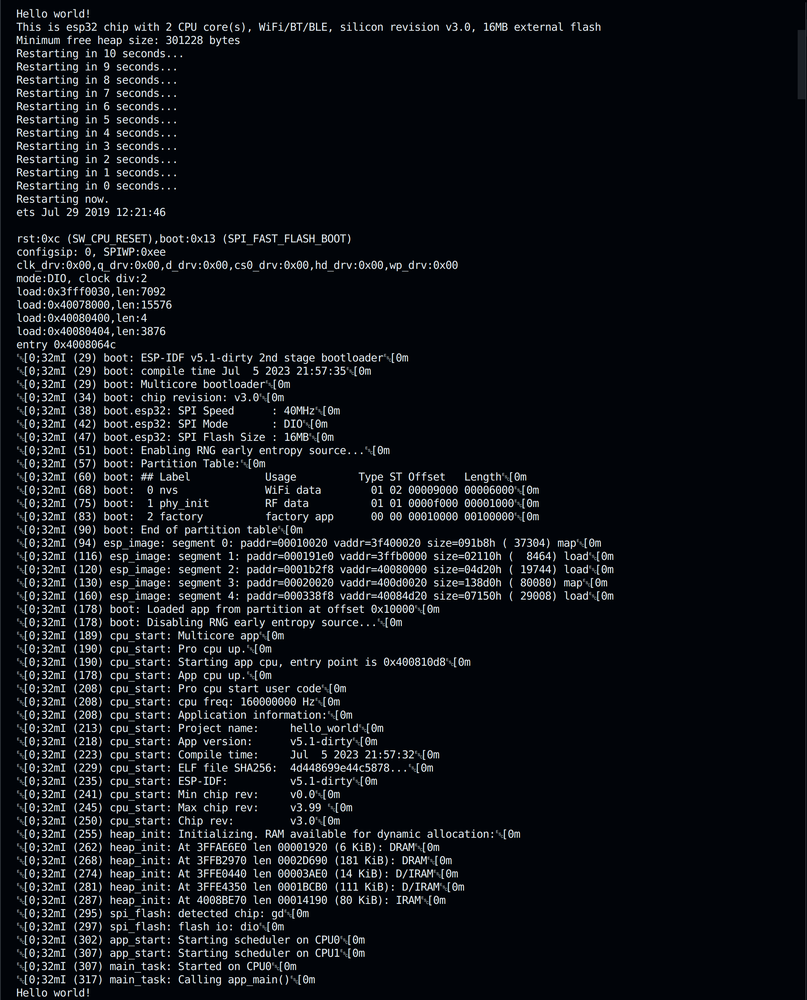

# ESP32 FreeRTOS CLI

This is a Command Line Interface for the ESP32 using the ESP32 multicore port of FreeRTOS.
This project started in the [`ADolbyB/rtos-esp32-examples`](https://github.com/ADolbyB/rtos-esp32-examples) 
repository as `04-LED-CLI`, but it took on a life of its own and it turned into this project.

Currently, the CLI can perform the following on the ESP32 Thing Plus C from SparkFun.
 - Command the RGB LED connected to `GPIO_2`.
 - The Blue LED connected to `GPIO_13`.
 - [In Progress] The on-board SD Card Slot connected to `GPIO_5`.
     - Test Code: [SD_Test](https://github.com/sparkfun/SparkFun_Thing_Plus_ESP32_WROOM_C/blob/main/Firmware/Test%20Sketches/SD_Test/SD_Test.ino)
 - [In Progress] The on-board MAX17048 $I^2C$ LiPo Battery Fuel Guage.
     - Test Code: [MAX17048_FuelGuage](https://github.com/sparkfun/SparkFun_Thing_Plus_ESP32_WROOM_C/blob/main/Firmware/Test%20Sketches/MAX17048_FuelGauge/MAX17048_FuelGauge.ino)

This is a work in progress.

## Status:

## References:

General FreeRTOS:
 
 - FreeRTOS is Currently Documented by [AWS: FreeRTOS Documentation](https://docs.aws.amazon.com/freertos/index.html)

 - Also see links listed here by [FreeRTOS.org: FreeRTOS Documentation](https://www.freertos.org/Documentation/RTOS_book.html)

Setup & Programming:

 - Read the official [Getting Started with VS Code IDE](https://docs.espressif.com/projects/esp-idf/en/v4.2.5/esp32/get-started/vscode-setup.html) Setup Guide, including the [VS Code ESP IDF Extension](https://github.com/espressif/vscode-esp-idf-extension).

 - Read the official [ESP32 Arduino Core Documentation](https://espressif-docs.readthedocs-hosted.com/projects/arduino-esp32/en/latest/index.html).

 - Read the official [ESP-IDF Programming Guide](https://docs.espressif.com/projects/esp-idf/en/latest/esp32/index.html).

 - The board I used for practice is an [ESP32 Thing Plus C](https://www.sparkfun.com/products/18018) from [SparkFun](https://www.sparkfun.com/).
      - Specs from `hello_world` sample sketch: 

Firmware Flashing:

 - [Flash AT Firmware into Your Device](https://docs.espressif.com/projects/esp-at/en/latest/esp32/Get_Started/Downloading_guide.html) in the Espressif ESP-AT User Guide.

 - [ESP32 AT](https://www.espressif.com/en/products/socs/esp32/resources) .bin files.